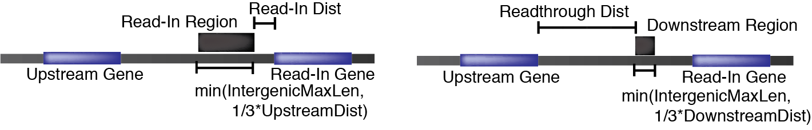
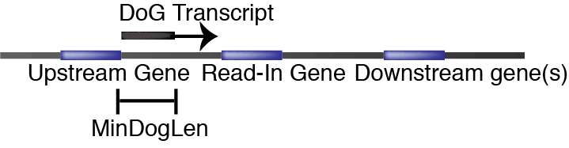

# Automatic Readthrough Transcription DEteCtiOn: ARTDeco
ARTDeco is a pipeline for analyzing and characterizing transcriptional readthrough as described in Roth et al. (2019, in preparation). Broadly, ARTDeco functions to process a set of BAM files such that transcriptional readthrough can be quantified via a variety of measures including read-in levels, readthrough levels, downstream of gene (DoG) transcript detection, and inference of read-in genes. ARTDeco works on both single-end and paired-end data, stranded and unstranded data, and forward and reverse strand oriented data (more information on this [below](#assorted-usage-notes)).
## Getting started
### Prerequisites
ARTDeco is a Python package that requires Python 3.6 or higher. Additionally, the following packages are required:
```
bedops>=2.4.35
bx-python>=0.8.2
DESeq2>=1.20
Homer>=4.9
numpy>=1.16.2
pandas>=0.24.2
rpy2>=2.9.4
RSeQC>=3.0.0
samtools=1.9
setuptools
```
The easiest way to install these is to use either Anaconda or Miniconda as a package manager using the [Bioconda](https://bioconda.github.io/) channel and the following command:
```
conda install bedops=2.4.* bioconductor-deseq2=1.20.* bx-python=0.8.* homer=4.9.* numpy=1.16.* pandas=0.24.* pybigwig rpy2=2.9.* rseqc=3.0.* samtools=1.9
```
This is recommended because the dependency management of conda is very good. With this in mind, I've created a simple conda environment for running ARTDeco (located in the Conda folder) if you don't feel like adding these packages to your current environment. Go into the Conda directory and run the following code:
```
conda env create -f environment.yml
```
This creates an environment called ARTDeco.

A conda recipe for ARTDeco is in development and should be out fairly soon with Bioconda. It is important to note that Bioconda's version of Homer is a bit buggy so you will not get the full functionality of Homer (which is not necessary here).
### Installation
Once the prerequisites are installed, go into the same directory as setup.py and run the following code:
```
python setup.py install
```
ARTDeco should be installed. In the future, there will be both pip and conda options for installation.
### Preparing files
Once all prerequisites have been installed, there are a few files that are necessary before starting. At a bare minimum, you need a GTF file for your genome of interest as well as a chromosome sizes file. 

ARTDeco converts these GTF files to BED files for manipulation as well as detection of BAM file information (covered in more depth below) using a utility from BEDOPS (gtf2bed). gtf2bed is formatted for GTFs with UCSC standard format and is temperamental with GENCODE files. Run the following command to check if your GTF file works:
``` 
gtf2bed < genes.gtf
```
If the output is the following, then you have an issue:
``` 
Error: Potentially missing gene or transcript ID from GTF attributes (malformed GTF at line [1]?)
```
The solution to this is actually simple:
``` 
awk '{ if ($0 ~ "transcript_id") print $0; else print $0" transcript_id \"\";"; }' genes.gtf > modified_genes.gtf
```
Hopefully, BEDOPS will correct this bug or I will write my own parser if possible.

Additionally, ARTDeco requires a chromosome sizes file. This is easily generated using samtools with the following few lines of code:
``` 
samtools faidx genome.fa
cut -f1,2 genome.fa.fai > genome.chrom.sizes
```

There are two other files that need to be generated if the user wants to utilize differential expression in the analyses (covered below). These are the meta file and the comparisons file. The meta file puts labels to each experiment for DESeq2 and the comparisons file tells the differential expression script which comparisons to outcome. These files are tab-delimited and examples are given in the SampleInputs folder in the repository.

The comparisons file is not strictly necessary and ARTDeco will generate one. However, this is not recommended as ARTDeco will do an all-by-all comparisons and this can be time consuming with larger datasets.

ARTDeco will automatically reformat these files when running any differential expression so that they play well with DESeq2. 

The only remaining requirement in terms of files is that you place all of your BAM files in a directory. ARTDeco will generate a directory structure (discussed in the [Interpreting ARTDeco Outputs](#interpreting-artdeco-outputs) section) around these files.
## Running ARTDeco
In this section, standard usage for each mode of  ARTDeco will be outlined. The [next section](#interpreting-artdeco-outputs) will explain the structure of the outputs and how to them. The ARTDeco help screen can be viewed using the following command:
``` 
ARTDeco -h
```
Because ARTDeco uses a standard output structure, this allows it to compute the existence of various file dependencies in order to both reduce redundancy and run time. There is an option (-overwrite) which tells the program to regenerate all files for the given mode. This is useful if you are changing one of the user inputs such as the GTF file. NOTE: this computation of dependencies is kept relatively mode-specific because ARTDeco does not use an engine like Snakemake to autocompute all dependencies (perhaps for a future version). Thus, these are the following sequences recommended for running ARTDeco (omit the last step if you aren't performing differential expression analysis):
``` 
preprocess --> intergenic --> diff_exp_read_in
                          |
                          |
                          --> get_dogs --> diff_exp_dogs
```
The final note on running ARTDeco is that all of the BAM files should be from the same experimental set. Not only does this make sense in terms of good experimental practice, ARTDeco is built to generate files differently for differently formatted BAM files. The users can specify these formats in the command line or ARTDeco can infer the file format of the BAM (i.e., paired-end vs. single-end, stranded-specific vs. unstranded, and forward vs. reverse strand orientation). These formats are necessary when generating many of the files (e.g., strandedness is important for counting reads for various regions).
### Preprocessing mode
ARTDeco's preprocessing mode generates most of the prerequisite files needed for downstream analysis. Specifically, these files include the following:
``` 
genes.full.bed -- A BED file conversion of the user-provided GTF file as generated by BEDOPS. Used for generation of genes_condensed.bed and inference of BAM file format
genes_condensed.bed -- A BED file of condensed gene annotations (all protein coding genes with the minimum start coordinate and maximum stop coordinate).
gene_to_transcript.txt -- A tab-delimited file mapping transcripts to genes.
read_in.bed -- A BED file of read-in regions.
readthrough.bed -- A BED file of readthrough/downstream regions.
Homer tag directories of the same name as the BAM files.
```
All of these files reside in the preprocess_files directory.

You can run preprocessing using the following command:
``` 
ARTDeco -mode preprocess -gtf-file GTF_FILE -chrom-sizes-file CHROM_SIZES_FILE [-home-dir HOME_DIR -cpu CPU -read-in-dist READ_IN_DIST -readthrough-dist READTHROUGH_DIST -intergenic-min-len INTERGENIC_MIN_LEN -intergenic-max-len INTERGENIC_MAX_LEN]
```
The required arguments are -mode, -gtf-file, and -chrom-sizes-file. All other arguments are optional. Their default values are as follows:
``` 
-home-dir -- Directory in which ARTDeco is run (and contains BAM files). Default is current directory.
-cpu -- Number of CPU to use. Default is 1.
-read-in-dist -- Distance upstream of gene to place read-in region. Default is 1 kb.
-readthrough-dist -- Distance downstream of gene to place readthrough/downstream region. Default is 5 kb.
-intergenic-min-len -- Minimum length of an intergenic region. Default is 100 bp.
-intergenic-max-len -- Maximum length of an intergenic region. Default is 15 kb.
```
### Intergenic mode
ARTDeco's intergenic mode generates some of the summary files that contain the read-in and readthrough-levels as well as read-in gene assignments. Additionally, intergenic mode generates quantification files for genes and intergenic regions. Because this mode requires the BED file from the converted GTF file and a gene-to-transcript mapping, it will regenerate gene annotation files in preprocess_files if they do not exist or overwrite is specified. NOTE: no other required files will be regenerated and you will get an error message if you do not generate those files by running the [preprocessing](#preprocessing-mode) mode. If overwrite is specified, these are the files generated:
``` 
---Preprocessing files---
genes.full.bed -- A BED file conversion of the user-provided GTF file as generated by BEDOPS. Used for generation of genes_condensed.bed and inference of BAM file format
genes_condensed.bed -- A BED file of condensed gene annotations (all protein coding genes with the minimum start coordinate and maximum stop coordinate).
gene_to_transcript.txt -- A tab-delimited file mapping transcripts to genes.
---Quantification files---
gene.exp.fpkm.txt -- Gene expression in FPKM.
gene.exp.raw.txt -- Raw counts for gene expression.
max_isoform.txt -- Maximum isoform for each gene.
read_in.raw.txt -- Raw counts for read-in regions.
readthrough.raw.txt -- Raw counts for readthrough/downstream regions.
---Intergenic files---
read_in_assignments.txt -- Assignment of primary induction and read-in genes with read-in level for each experiment.
read_in.txt -- Combination of gene expression and read-in quantification information. Contains read-in levels.
readthrough.txt -- Combination of gene expression and readthrough quantification information. Contains readthrough levels.
```
Preprocessing files reside in the preprocess_files directory, quantification files reside in the quantification directory and intergenic files reside in the intergenic directory.

You can run intergenic mode using the following command:
``` 
ARTDeco -mode intergenic -gtf-file GTF_FILE [-home-dir -cpu CPU -read-in-threshold READ_IN_THRESHOLD -read-in-fpkm READ_IN_FPKM]
```
The required arguments are -mode and -gtf-file. All other arguments are optional. Their default values are as follows:
``` 
-home-dir -- Directory in which ARTDeco is run. Default is current directory.
-cpu -- Number of CPU to use. Default is 1.
-read-in-threshold -- Threshold for read-in level for assigning a gene as a read-in gene. Default value is 0.
-read-in-fpkm -- Threshold for gene expression in FPKM for assigning a gene as a read-in gene. Default value is 0.25 FPKM.
```
### DoG Transcript Discovery mode
ARTDeco's get_dogs mode discovers DoG transcripts for each BAM file. In addition to this, it merges all DoG annotations into a single BED file and quantifies all of these files (raw tag counts and FPKM). Similar to intergenic mode, get_dogs mode requires gene annotations from preprocessing mode (both full and condensed BED files) so they will be generated if they are not present or if an overwrite is specified. Again, other prerequisite files will not be regenerated so be sure to run [preprocessing](#preprocessing-mode) and [intergenic](#intergenic-mode) modes. If overwrite is specified, these are the files generated:
``` 
---Preprocessing files---
genes.full.bed -- A BED file conversion of the user-provided GTF file as generated by BEDOPS. Used for generation of genes_condensed.bed and inference of BAM file format
genes_condensed.bed -- A BED file of condensed gene annotations (all protein coding genes with the minimum start coordinate and maximum stop coordinate).
gene_to_transcript.txt -- A tab-delimited file mapping transcripts to genes.
---DoG files---
BAM_PREFIX.dogs.bed -- BED file of DoGs for each experiment BAM_PREFIX.
BAM_PREFIX.dogs.fpkm.txt -- DoG expression in FPKM for each experiment BAM_PREFIX.
BAM_PREFIX.dogs.raw.txt -- DoG expression in raw counts for each experiment BAM_PREFIX.
all_dogs.bed -- BED file of DoGs for all experiments.
all_dogs.fpkm.txt -- DoG expression in FPKM for all of the DoGs in all experiments.
all_dogs.raw.txt -- DoG expression in raw counts for all of the DoGs in all experiments.
```
Preprocessing files reside in the preprocess_files directory and DoG files reside in the dogs directory.

You can run DoG discovery mode using the following command:
``` 
ARTDeco -mode get_dogs -gtf-file GTF_FILE -chrom-sizes-file CHROM_SIZES_FILE [-home-dir HOME_DIR -cpu CPU -min-dog-len MIN_DOG_LEN -dog_window DOG_WINDOW -min_dog_coverage MIN_DOG_COVERAGE]
```
The required arguments are -mode, -gtf-file, and -chrom-sizes-file. All other arguments are optional. Their default values are as follows:
``` 
-home-dir -- Directory in which ARTDeco is run. Default is current directory.
-cpu -- Number of CPU to use. Default is 1.
-min-dog-len -- Minimum DoG length. Default is 4 kb.
-dog-window -- DoG window size. Default is 500 bp.
-min-dog-coverage -- Minimum FPKM for DoG discovery. Default is 0.1 FPKM.
```
### Differential Expression with Read-In Information mode
ARTDeco's diff_exp_read_in mode performs differential expression analysis on gene expression and pairs it with read-in information. It also assigns read-in genes that are condition-specific by leveraging differential expression information as well as read-in levels. As with intergenic and get_dogs modes, be sure to run previous modes ([preprocess](#preprocessing-mode) and [intergenic](#intergenic-mode)) in order to generate all prerequisites. If overwrite is specified, these are the files generated:
``` 
---Preprocessing files---
meta.reformatted.txt -- A reformatted meta file. Reformatted so that it plays nicely with DESeq2.
comparisons.reformatted.txt -- A reformatted comparisons file. Reformatted so that it plays nicely with DESeq2.
---Differential expression files---
CONDITION1-CONDITION2-results.txt -- DESeq2 results for comparisons for CONDITION1 vs. CONDITION2. Generated for each pair of conditions as specified.
---Differential expression with read-in information files---
CONDITION1-CONDITION2-read_in.txt -- DESeq2 results paired with read-in information for CONDITION1 vs. CONDITION2. Generated for each pair of conditions as specified.
CONDITION1-CONDITION2-read_in_assignment.txt -- Assignment of primary induction and read-in genes by combining DESeq2 information with read-in genes.
```
Preprocessing files reside in the preprocess_files directory, differential expression files are reside in the diff_exp directory, and differential expression with read-in information files reside in the diff_exp_read_in directory.

You can run differential expression with read-in information mode using the following command:
``` 
ARTDeco -mode diff_exp_read_in -meta-file META_FILE [-home-dir HOME_DIR -read-in-threshold READ_IN_THRESHOLD -read-in-fpkm READ_IN_FPKM -comparisons-file COMPARISONS_FILE -log2FC LOG2FC -pval PVAL]
```
The required arguments are -mode and -meta-file (not needed if meta.reformatted.txt file exists). All other arguments are optional. Their default values are as follows:
``` 
-home-dir -- Directory in which ARTDeco is run. Default is current directory.
-read-in-threshold -- Threshold for read-in level for assigning a gene as a read-in gene. Default value is 0.
-read-in-fpkm -- Threshold for gene expression in FPKM for assigning a gene as a read-in (or primary induction) gene. Default value is 0.25 FPKM.
-comparisons-file -- Comparisons file as described above. Default is no file. Program will generate all-by-all comparisons file.
-log2FC -- Minimum log2 fold change for considering a gene upregulated. Default is 2.
-pval -- Maximum p-value for considering a gene upregulated. Default is 0.05.
```
### DoG Differential Expression mode
ARTDeco's diff_exp_dogs mode performs differential expression analysis on DoGs discovered in get_dogs mode. As with get_dogs mode, be sure to run previous modes ([preprocess](#preprocessing-mode), [intergenic](#intergenic-mode), and [get_dogs](#dog-transcript-discovery-mode)) in order to generate all prerequisites. If overwrite is specified, these are the files generated:
``` 
---Preprocessing files---
meta.reformatted.txt -- A reformatted meta file. Reformatted so that it plays nicely with DESeq2.
comparisons.reformatted.txt -- A reformatted comparisons file. Reformatted so that it plays nicely with DESeq2.
---DoG Differential Expression files---
CONDITION1-CONDITION2-results.txt -- DESeq2 results for comparisons for CONDITION1 vs. CONDITION2. Generated for each pair of conditions as specified.
```
Preprocessing files reside in the preprocess_files directory and differential expression files are reside in the diff_exp directory.

You can run DoG differential expression mode using the following command:
``` 
ARTDeco -mode diff_exp_dogs -meta-file META_FILE [-home-dir HOME_DIR -comparisons-file COMPARISONS_FILE]
```
The required arguments are -mode and -meta-file (not needed if meta.reformatted.txt file exists). All other arguments are optional. Their default values are as follows:
``` 
-home-dir -- Directory in which ARTDeco is run. Default is current directory.
-comparisons-file -- Comparisons file as described above. Default is no file. Program will generate all-by-all comparisons file.
```
## Interpreting ARTDeco Outputs
This section outlines how to interpret the major outputs from running ARTDeco. Rather than outlining the format of every single file, we will focus on results pertaining to interpreting levels of readthrough.

Before focusing on those specific files, let's go over the directory structure that ARTDeco creates. As mentioned above, the user specifies a home directory that contains all of the BAM files. Within this directory, ARTDeco creates a standardized structure where all of the files will be stored. This makes it so that ARTDeco does not recompute all requirements each time (unless specified with a -overwrite command). It also makes dependency management quite easy. (Note: this is subject to change if a better structure/formatting scheme is suggested/implemented). Here is the basic directory structure if you ran all usage modes:
``` 
/home-dir (user-specified)
    BAM_FILES
    /diff_exp
        CONDITION1-CONDITION2-results.txt (for each CONDITION1 vs. CONDITION2 as specified by comparisons file)
    /diff_exp_dogs
        CONDITION1-CONDITION2-results.txt (for each CONDITION1 vs. CONDITION2 as specified by comparisons file)
    /diff_exp_read_in
        CONDITION1-CONDITION2-read_in.txt (for each CONDITION1 vs. CONDITION2 as specified by comparisons file)
        CONDITION1-CONDITION2-read_in_assignment.txt (for each CONDITION1 vs. CONDITION2 as specified by comparisons file)
    /dogs
        BAM_PREFIX.dogs.bed (for each experiment BAM_PREFIX)
        BAM_PREFIX.dogs.fpkm.txt (for each experiment BAM_PREFIX)
        BAM_PREFIX.dogs.raw.txt (for each experiment BAM_PREFIX)
        all_dogs.bed
        all_dogs.fpkm.txt
        all_dogs.raw.txt
    /intergenic
        read_in_assignments.txt 
        read_in.txt
        readthrough.txt
    /preprocess_files
        comparisons.reformatted.txt
        genes.full.bed
        genes_condensed.bed
        gene_to_transcript.txt
        meta.reformatted.txt
        read_in.bed
        readthrough.bed
        Homer tag directories of the same name as the BAM filename prefix
    /quantification
        gene.exp.fpkm.txt
        gene.exp.raw.txt
        max_isoform.txt
        read_in.raw.txt
        readthrough.raw.txt
```
Now, let's go through the files that are most relevant to interpreting findings on transcriptional readthrough.
### Preprocessing files
The main files to understand section are the read_in.bed and readthrough.bed files. These are standard BED format files that are used for quantification downstream. These regions are defined by parameters in [preprocess](#preprocessing-mode) mode. Here is a diagram of how these regions relate to a given gene annotation:

### Intergenic files
read_in.txt and readthrough.txt are tab-delimited files that combine gene expression information with read-in and readthrough information for all of the experiments. The format for readthrough.txt is as follows where Sample1.bam is a user-supplied BAM file:
``` 
Gene ID Transcript ID   Sample1 Gene Count  Sample1 Gene FPKM   Sample1 Readthrough Count   Sample1 log2Ratio Readthrough vs. Gene
ENSG00000000003 ENST00000373020.8   25.31821533923304   0.073   0.0 -4.717989756888586
```
This pattern is continued for all samples. Each Gene ID/Transcript ID represents the maximally expressed isoform of the gene. The log2Ratio Readthrough vs. Gene column represents the readthrough level. For read-in values, the format is the same except the 4th column for each sample is log2Ratio Read-In vs. Gene (representing the read-in level). 

read_in_assignments.txt is also a tab-delimited file that gives assignments of primary induction and read-in genes given an FPKM threshold (for being considered sufficiently expressed for classification) and a read-in level threshold. The format for read_in_assignments.txt is as follows where Sample1.bam is a user-supplied BAM file:
``` 
Gene ID	Transcript ID	Sample1 log2Ratio Read-In vs. Gene	Sample1 Assignment
ENSG00000078098	ENST00000493182.1   0.12985045354144553 Read-In
```
### Differential expression with read-in information files
These files are similar to the read-in files presented [above](#intergenic-files) except with the addition of differential expression information. Here is the format for Condition1 and Condition2 in an experimental setup for Condition1-Condition2-read_in.txt:
```
Gene ID	Transcript ID	baseMean	log2FoldChange	lfcSE	stat	pvalue	padj	Condition1 Average Gene Count	Condition1 Average Gene FPKM	Condition1 Average Read-In Count	Condition1 Read-In vs. Gene	Condition2 Average Gene Count	Condition2 Average Gene FPKM	Condition2 Average Read-In Count	Condition2 Read-In vs. Gene
ENSG00000000003	ENST00000373020.8	22.48700673497269	-0.09573036928300477	0.6833548748335975	-0.1400888071608707	0.8885898239774688	0.9316616219680052	19.457227138643070.026500000000000003	1.251052395879982	-3.1839390664755927	27.469026548672566	0.0765	1.251052395879982	-3.6607216206385216
```
Similarly, here is the format for Condition1-Condition2-read_in_assignments.txt:
``` 
Gene ID	Transcript ID	log2FoldChange	padj	Condition1 Read-In vs. Gene	Assignment
ENSG00000000971	ENST00000470918.1	2.7213205249230485	1.832392496818623e-06	-7.642135066085642	Primary Induction
```
### DoG files
A DoG transcript (shortened to DoG) is a transcript that extends beyond the annotated transcription termination site. ARTDeco scans for DoGs by scanning the tag density (as measured by FPKM) in the downstream region of genes in user-specified window. What makes ARTDeco unique is that it leverages read-in levels to infer whether a downstream gene has significant readthrough when scanning these regions. Thus, DoG transcripts can extend several genes. Here is a diagram of the basic concept behind DoG transcript discovery:


The dogs directory contains BED files of DoGs for each experiment (the naming convention is BAM_PREFIX.dogs.bed where BAM_PEFIX.bam is our BAM file) as well as a merged file called all_dogs.bed. This merged file contains all discovered DoGs from all experiments. When a DoG appears in multiple experiments, the longest discovered version is used.

There are also quantification files for each set of DoGs (for each experiment and across all experiments) with both raw counts and FPKM. These are tab-delimited files that contain the ID (gene name) for the DoG, the length of the DoG (as rendered by Homer), and the expression value for the experiment(s).
### Differential expression for DoG
Using the quantification of all_dogs.bed (i.e., all_dogs.raw.txt) as well as the earlier described meta and comparison files, ARTDeco will perform differential expression analysis with DESeq2 and output results for specified comparisons in a tab-delimited file. Here is the format for Condition1 and Condition2 in an experimental setup for Condition1-Condition2-results.txt:
``` 
	baseMean	log2FoldChange	lfcSE	stat	pvalue	padj
ENSG00000086300	4433.294680707477	3.651205201831191	0.2574798821695928	14.180545567541749	1.2090294748081953e-45	5.162555857430994e-44
```
For the sake of results, it is important to note the caveat of merging DoGs in the all_dogs.bed file: ARTDeco takes the longest possible DoG from the individual samples for a given gene. This can affect interpretation.
## Assorted Usage Notes
ARTDeco can theoretically take any genomic data that reflects the transcriptional state. This includes polyA-RNAseq, total RNAseq, RNA PolII ChIPseq, mNETseq, GROseq, etc. However, it should be noted that strand-specific data is preferable where possible. The lack of strandedness lowers the number of possible read-in and readthrough genes (because the transcriptional signal can come from either direction). Additionally, DoG finding is unlikely to work well because of similar issues.

Another consideration is the characteristics of your data. The default settings tend to work well for stranded total RNAseq, but be sure to examine your own data to see if the assumptions fit. For example, when using RNA PolII ChIPseq, it is wise to set the readthrough distance to longer than default because that data typically has increased signal downstream of annotated transcription termination sites. This highlights the need for understanding the nature of your data prior to applying a computational technique (always a good practice).

The distribution of read-in and readthrough levels is generally reflective of total level of transcriptional readthrough present in a dataset. With this in mind, the median readthrough level is a good potential summary statistic for quantifying readthrough. However, you may want to filter for higher expressing genes as this leaves you less liable to fall victim to sources of error due to gene annotation and noise.

If there are other concerns, I'll add them here.
## Author/Support
Samuel J. Roth [sjroth@eng.ucsd.edu](mailto:sjroth@eng.ucsd.edu), PhD Candidate, [Benner Lab](http://homer.ucsd.edu/BennerLab/), UCSD Department of Medicine
